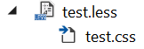

# CSS AutoPrefixer

[](https://ci.appveyor.com/project/madskristensen/lesscompiler)

Download this extension from the [Marketplace](https://marketplace.visualstudio.com/items?itemName=MadsKristensen.LESSCompiler)
or get the [CI build](http://vsixgallery.com/extension/d32c5250-fa82-4da6-9732-5518fabebfef/).

---------------------------------------

An alternative LESS compiler with no setup. Uses the official node.js based LESS compiler under the hood with AutoPrefixer and CSSComb built in.

See the [change log](CHANGELOG.md) for changes and road map.

## Features

- Compiles .less files on save
- Uses the [official LESS](https://www.npmjs.com/package/less) node module
- Automatially runs [autoprefix](https://www.npmjs.com/package/less-plugin-autoprefix)
- Automatically runs [CSSComb](https://www.npmjs.com/package/less-plugin-csscomb)
- All compiler options configurable
- Minification support

### Compile on save
All .less files will automatically be compiled into a .css file nested under it in Solution Explorer.



The automatic compilation doesn't happen if:

1. The .less file starts with an `_` like `_variables.less`
2. The .less file isn't part of any project
3. A comment in the .less file with the word `no-compile` is found

The Output Window shows details about what is being executed to make it easy to troubleshoot any issues.

### Compiler options
You can set any compiler options as defined on the [LESS compiler website](http://lesscss.org/usage/#command-line-usage) inside a comment in the `.less` file. The comment is prefixed with `lessc` followed by the compiler options.

```less
// lessc --strict-math=on

body {
  margin: 0.3px * 4px;
}
```

The default less compiler arguments are:

```bash
lessc "<file.less>" --relative-urls --autoprefix="> 0%" --csscomb=zen "<file.css>"
```

Here are some examples of the code comments to use in the `.less` files:

#### Source map
```less
// lessc --source-map
```

This will produce a `.map` file next to the generated `.css` file. Be aware that if you specify a file name for the source map like `--source-map=file.map`, the file may not be included in the project. Just use the flag without the file name like this `--source-map`.

#### Output to other directory
```less
// lessc "../wwwroot/css/file.css"
```

#### Autoprefix
```less
// lessc --autoprefix="last 2 versions, > 5%"
```

See [Browserlist](https://github.com/ai/browserslist) for description on how to construct the value.

#### Minification
By default a `.min.css` file is generated, but that can be turned off by a comment containing `no-minify` in it. You can combine it with the compiler configuration like so:

```less
// no-minify lessc --relative-urls"
```

#### Combine it all
```less
// no-minify lessc --relative-urls --source-map "../wwwroot/css.file.css"
```

This example doesn't minify the output, enables both relative urls and source maps and redirects the output file to a different directory.

## Contribute
Check out the [contribution guidelines](.github/CONTRIBUTING.md)
if you want to contribute to this project.

For cloning and building this project yourself, make sure
to install the
[Extensibility Tools 2015](https://visualstudiogallery.msdn.microsoft.com/ab39a092-1343-46e2-b0f1-6a3f91155aa6)
extension for Visual Studio which enables some features
used by this project.

## License
[Apache 2.0](LICENSE)