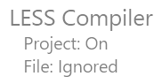
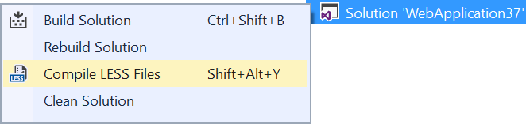

# CSS AutoPrefixer

[](https://ci.appveyor.com/project/madskristensen/lesscompiler)

Download this extension from the [Marketplace](https://marketplace.visualstudio.com/items?itemName=MadsKristensen.LESSCompiler)
or get the [CI build](http://vsixgallery.com/extension/d32c5250-fa82-4da6-9732-5518fabebfef/).

---------------------------------------

An alternative LESS compiler with no setup. Uses the official node.js based LESS compiler under the hood with AutoPrefixer and CSSComb built in.

See the [change log](CHANGELOG.md) for changes and road map.

## Features

- Compiles .less files on save
- Uses the [official LESS](https://www.npmjs.com/package/less) node module
- Automatially runs [autoprefix](https://www.npmjs.com/package/less-plugin-autoprefix)
- Support for [CSSComb](https://www.npmjs.com/package/less-plugin-csscomb)
- All compiler options configurable
- Minification support

### Compile on save
All .less files will automatically be compiled into a .css file nested under it in Solution Explorer after being enabled on the project.

By default, compilation is off and that's indicated by a watermark at the bottom right corner of any LESS file.


To enable LESS compilation, simply click the watermark and it changes to indicate LESS compilation is "on".


For files that are being ignored, the watermark looks like this:



All `.less` files in the following folders are ignored from compilation:

1. node_modules
2. bower_components
3. jspm_packages
4. lib
5. vendor

You can stil reference these files from your own `.less` files, but they will not be compiled themselves.

Saving the LESS file will then compile into CSS.


The automatic compilation doesn't happen if:

1. The project hasn't been enabled for LESS compilation
2. The .less file starts with an `_` like `_variables.less`
3. The .less file isn't part of any project
4. A comment in the .less file with the word `no-compile` is found

The Output Window shows details about what is being executed to make it easy to troubleshoot any issues.

**Note** that the the solution (.sln) file is updated to reflect that LESS compilation is enabled. Remember to save the solution when prompted to persits the information.

### Compile all .less files
The solution node in Solution Explorer has a command to compile all `.less` files in the projects enabled.



### Compiler options
You can set any compiler options as defined on the [LESS compiler website](http://lesscss.org/usage/#command-line-usage) inside a comment in the `.less` file. The comment is prefixed with `lessc` followed by the compiler options.

```less
// lessc --strict-math=on
```

The default less compiler arguments are:

```bash
lessc --relative-urls --autoprefix="> 0%" "<file.css>"
```

Here are some examples of the code comments to use in the `.less` files:

#### Source map
```less
// lessc --source-map
```

This will produce a `.map` file next to the generated `.css` file. Be aware that if you specify a file name for the source map like `--source-map=file.map`, the file may not be included in the project. Just use the flag without the file name like this `--source-map`.

#### Output to other directory
```less
// lessc "../wwwroot/css/file.css"
```

#### Autoprefix
```less
// lessc --autoprefix="last 2 versions, > 5%"
```

See [Browserlist](https://github.com/ai/browserslist) for description on how to construct the value.

#### CSSComb
```less
// lessc --csscomb=zen
```

Available values are `zen`, `yandex` and `csscomb`. Remember to specify `--csscomb` after `--autoprefix` if both are specified.

#### Minification
By default a `.min.css` file is generated, but that can be turned off by a comment containing `no-minify` in it. You can combine it with the compiler configuration like so:

```less
// no-minify lessc --relative-urls"
```

#### Combine it all
```less
// no-minify lessc --relative-urls --source-map "../wwwroot/css.file.css"
```

This example doesn't minify the output, enables both relative urls and source maps and redirects the output file to a different directory.

### Compiler default options
You can specify the compiler options for the solution, the project or for individual folders by placing a file called `less.defaults` in any folder next to or above the .less files.

The default file cannot contain information about the output file, but all other options can be set.

**Example:**

```
--source-map --relative-urls --strict-math
```

Note that it isn't prefixed with `//` 

Even though minification isn't technically an option you set on the compiler, you can still opt out of minification like so:

```
no-minify --source-map --relative-urls --strict-math
```

## Contribute
Check out the [contribution guidelines](.github/CONTRIBUTING.md)
if you want to contribute to this project.

For cloning and building this project yourself, make sure
to install the
[Extensibility Tools 2015](https://visualstudiogallery.msdn.microsoft.com/ab39a092-1343-46e2-b0f1-6a3f91155aa6)
extension for Visual Studio which enables some features
used by this project.

## License
[Apache 2.0](LICENSE)